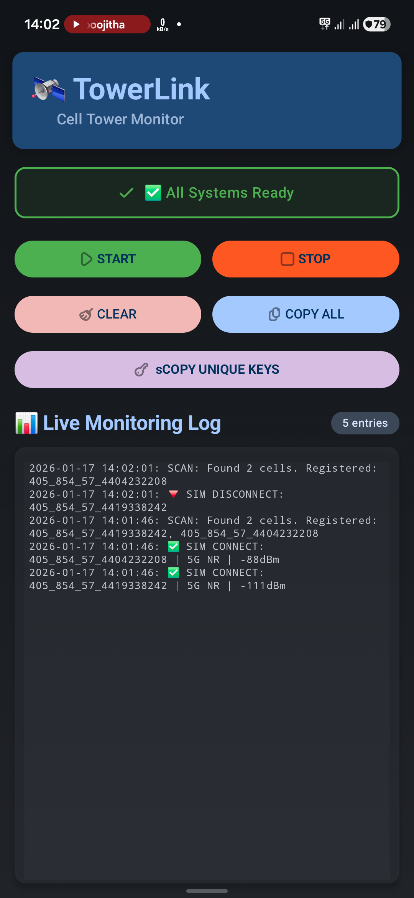
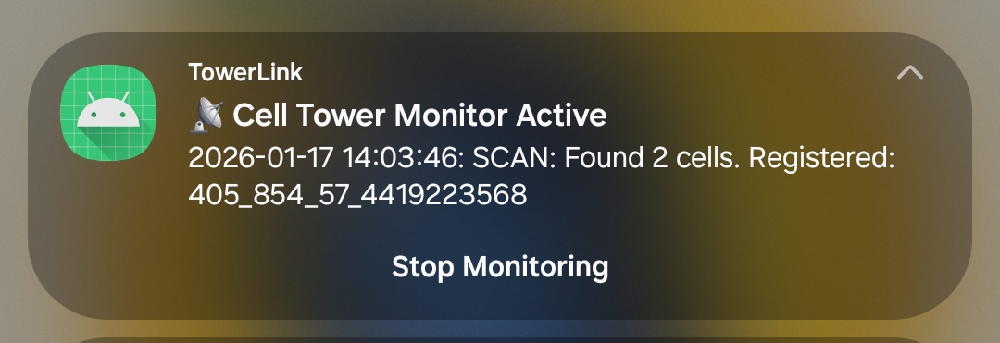

# TowerLink

A cell tower monitoring app for Android that tracks your device's connections to cellular towers in real-time.



## What it does

TowerLink continuously scans and logs the cell towers your phone connects to. It captures connection and disconnection events, signal strength, and tower identifiers. The app runs as a background service, so monitoring continues even when you're using other apps.

Each tower is identified using a standard format: `MCC_MNC_LAC_CID` (Mobile Country Code, Mobile Network Code, Location Area Code, Cell ID). This makes it easy to look up tower information in public databases or track which towers you've connected to over time.

## Features

- Real-time monitoring of cell tower connections
- Support for LTE, GSM, WCDMA, CDMA, and 5G NR networks
- Logs connection/disconnection events with timestamps
- Shows signal strength in dBm
- Background service with persistent notification
- Copy logs or unique tower keys to clipboard
- Tracks all unique towers encountered during a session



## Requirements

- Android 10 (API 29) or higher
- Location permission (required to access cell tower data)
- Notification permission (Android 13+)

## Building

Open the project in Android Studio and build using the standard Gradle workflow:

```
./gradlew assembleDebug
```

Or just hit the Run button in Android Studio.

## Permissions

The app requires location access to read cell tower information from the telephony APIs. This is an Android system requirement, not something the app can work around. The background location permission allows monitoring to continue when the app isn't in the foreground.

## Technical details

Built with Kotlin and Jetpack Compose. The monitoring service runs as a foreground service to ensure Android doesn't kill it during extended monitoring sessions. Tower data is parsed from Android's TelephonyManager APIs and stored in SharedPreferences for simplicity.

The scan interval is set to 15 seconds by default.

## License

Do whatever you want with it.
